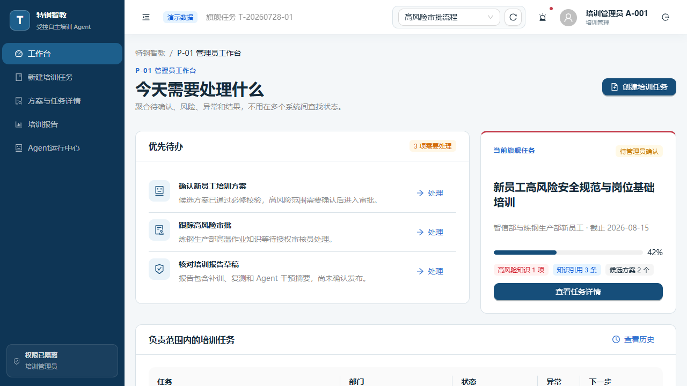
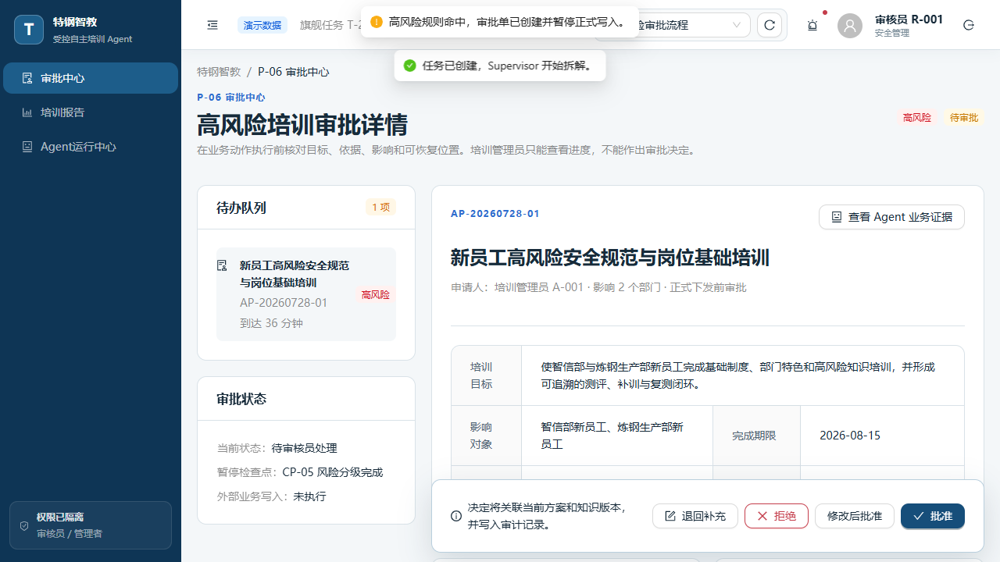
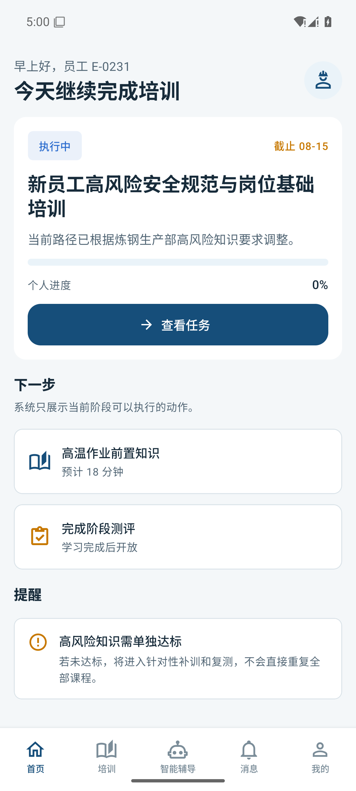
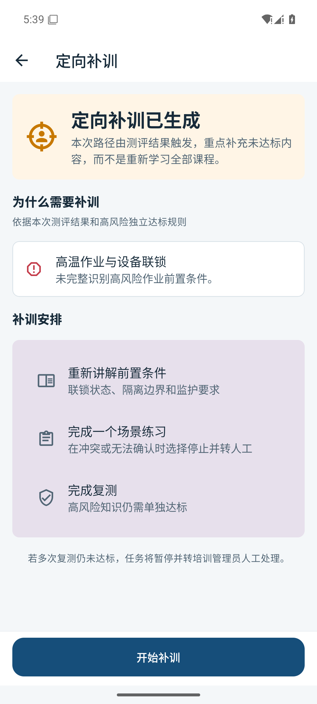

# 特钢智教 AI Agent

面向特钢企业员工培训的受控自主 Agent。仓库包含可运行的 Web 管理端与 React Native Android 员工端代码型高保真原型，并保留后续接入 FastAPI 的服务边界。

> 所有员工、制度、任务、测评和报告数据均为模拟数据，只用于验证页面、流程、权限和异常处理，不代表真实企业效果。

## 产品定位

为培训管理员、参训员工和审核人员提供从培训目标、知识检索、差异化方案、学习测评到补训复测、审批和报告的可追溯闭环；LMS 式记录、确定性规则、人工审批和 Agent 动态规划各自承担适合的职责。

## 平台分工

| 平台 | 主要角色 | 重点能力 |
| --- | --- | --- |
| Web | 培训管理员、审核员、系统管理员 | 目标创建、方案调整、高风险审批、报告、Agent 业务证据与开发者 Trace、知识配置 |
| Android | 员工/参训人员 | 我的培训、课程学习、知识引用、智能辅导、测评、补训、复测、消息和个人记录 |

移动端是原生 React Native 工程，不是 WebView，也不是 Web 后台的等比例缩小版。

## 运行截图

| Web 管理员工作台 | Web 高风险审批 | Android 员工首页 | Android 补训 |
| --- | --- | --- | --- |
|  |  |  |  |

更多真实运行截图见 [docs/screenshots](docs/screenshots/README.md)。

## 技术栈

- Monorepo：pnpm workspace
- Web：React 19、TypeScript、Vite、React Router、Zustand、Ant Design
- Android：React Native 0.81、Expo 54、React Navigation、Zustand、React Native Paper
- 共享：业务类型、Mock 数据、确定性规则、设计 Token、状态文案与工具
- 质量：TypeScript、ESLint、Vitest、Playwright、Gradle

## 目录结构

```text
apps/
  web/                 React Web 管理端
  mobile/              React Native 员工端
    android/           Android Studio 可打开的原生工程
packages/
  types/               业务与 API 类型
  mock-data/           集中的演示数据
  business-rules/      权限、风险、测评和恢复规则
  design-tokens/       跨端语义设计 Token
  shared-utils/        通用文案与格式化
docs/
  architecture/        前端与服务边界
  prototype/           可点击流程说明
  page-mapping/        PRD 页面映射
  screenshots/         实际运行截图
  test-reports/        实际验证记录
```

原有 `backend/`、`agent_core/`、`rag/`、`evals/`、`infra/`、`prototype/` 与治理文档均保留，尚未被本原型替换或删除。

## 环境要求

- Node.js 20.19 或更高版本（已验证 Node 24）
- pnpm 11.9
- Web 截图/E2E：Playwright Chromium
- Android：JDK 17、Android SDK、Android Studio 或命令行工具
- 推荐 Android SDK Platform 35 与对应 Build Tools

不要把 `local.properties`、`.env`、签名文件、Token 或本机 SDK 绝对路径提交到 Git。

## 安装与启动

```powershell
Set-Location "D:\TGZJ\agent"
pnpm install
pnpm dev:web
```

Web 地址：`http://127.0.0.1:5173`。

移动端：

```powershell
pnpm dev:mobile
pnpm android
```

如需重新生成 Android 原生工程：

```powershell
pnpm --filter @tegang/mobile prebuild:android
```

## Android Studio

直接打开 `apps/mobile/android`，使用 JDK 17，等待 Gradle 同步后运行 `app`。首次构建需要下载 Gradle 和 Maven 依赖。SDK 路径使用环境变量或未提交的 `local.properties`，不要写入源码。

## 演示账号

登录页不使用真实密码，点击角色卡即可切换：

| 角色 | 演示身份 | 可见范围 |
| --- | --- | --- |
| 员工 | 员工 E-0231 | 仅本人培训、学习、测评和消息；Web 提示转移动端 |
| 培训管理员 | 培训管理员 A-001 | 目标、方案、下发、进度、报告、Agent 业务视图 |
| 审核员 | 审核员 R-001 | 高风险审批、只读报告、Agent 业务证据 |
| 系统管理员 | 系统管理员 S-001 | 知识/规则配置与开发者 Trace |

权限同时作用于导航、路由、数据和按钮。直接访问无权限 URL 会进入“无权限访问”页面。

## 演示场景

- 正常培训流程
- 高风险审批流程
- 信息不足暂停
- 测评未达标、定向补训与复测
- 知识冲突与保守处理
- Agent/Skill 失败、有限重试、回退和人工接管

场景切换器只在演示模式出现。

## 旗舰业务流程

```text
Web 管理员创建目标与约束
→ Supervisor 拆解并生成候选方案
→ 管理员确认
→ 确定性风险校验
→ 高风险审批
→ 正式任务下发
→ Android 员工学习与智能辅导
→ 测评
→ 未达标时定向补训与复测
→ 报告与 Agent 轨迹
```

详细说明见 [代码型原型流程](docs/prototype/prototype-flow.md) 和 [页面映射](docs/page-mapping/README.md)。

## 构建与测试

```powershell
pnpm typecheck
pnpm lint
pnpm test
pnpm build:web
pnpm test:e2e
```

一次执行 Web 静态检查、单元测试和生产构建：

```powershell
pnpm check
```

Android 命令行构建：

```powershell
Set-Location "apps\mobile\android"
$env:JAVA_HOME = "你的 JDK 17 安装目录"
.\gradlew.bat assembleDebug
```

当前实际验证记录见 [prototype-validation.md](docs/test-reports/prototype-validation.md)。

## Mock 数据与 FastAPI 接入

页面通过服务接口访问数据，Mock 没有散落在页面组件中：

- Web：`apps/web/src/services`
- 移动端：`apps/mobile/src/services`
- 共享类型：`packages/types`
- 模拟数据：`packages/mock-data`

复制 `.env.example` 为本地 `.env` 后，可配置：

```dotenv
VITE_API_BASE_URL=
EXPO_PUBLIC_API_BASE_URL=
```

接入 FastAPI 时主要新增 HTTP 服务实现并在 `services/index.ts` 切换，不需要重写页面核心逻辑。详细边界见 [frontend-monorepo.md](docs/architecture/frontend-monorepo.md)。

## 已知限制

- 当前没有正式 FastAPI 后端、企业身份源、LMS 或知识库连接。
- 状态保存在本地演示会话，刷新页面会回到初始 Mock 状态。
- 模拟测评和报告不能证明真实培训效率或掌握度提升。
- Android 首次 Gradle 构建依赖外部下载；离线环境需要预先准备缓存。
- 本轮已用 Gradle Wrapper 和 Android 模拟器验证原生工程；Android Studio GUI 本身未由自动化流程打开。
- 当前尚未选择开源许可证，因此没有擅自新增 `LICENSE`。

## 原有项目导航

- [3 分钟导览](docs/quick-tour.md)
- [产品材料](docs/product/README.md)
- [状态看板](docs/status.md)
- [治理台账](docs/governance/task-ledger.md)
- [开发与 Git 约定](CONTRIBUTING.md)
